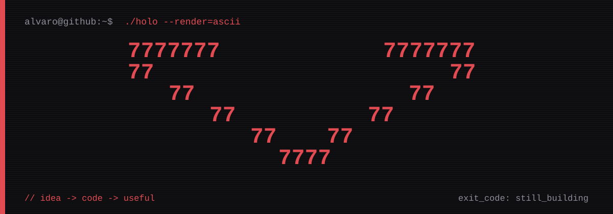
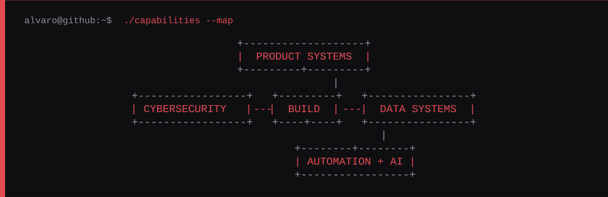

# Alvaro Patru / `AlvaroP100`

> Online as Alvaro P100. I build across software, infrastructure, data, security, automation, and AI. The interface is visible; the system behind it is the actual product.

```ts
const currentMode = "design > model > secure > build > ship";
const trustMeBroArchitecture = false;
```

## `/capabilities`



```text
product systems     web apps / internal tools / APIs / native iPad workflows
data management     PostgreSQL / Supabase / schemas / migrations / access rules
cybersecurity       auth / permissions / data privacy / RLS / secrets / threat models
reliability         monitoring / status pages / incident communication / failure design
automation + AI     model integrations / document flows / image flows / workflow tooling
infrastructure      servers / deployment / monitoring / operational tooling
```

I do not treat security and data as cleanup tasks. They belong in the architecture before the interface starts looking finished.

## `/stack`

```text
web        TypeScript / Next.js / Tailwind CSS
native     Swift / PencilKit
backend    Supabase / PostgreSQL
systems    APIs / automation / monitoring / GitHub Pages
```

## `/rules`

```js
if (clever && !clear) refactor();
if (status === "green" && !evidence) throw new Error("nice try");
if (security === "later") roadmap.reject();
if (readme !== reality) docs.fix();
```

## `/links`

- [`website / alvarop100.github.io`](https://alvarop100.github.io)
- [`linkedin / Alvaro Patru`](https://www.linkedin.com/in/alvaro-patru/)
- [`youtube / Alvaro P100`](https://www.youtube.com/@AlvaroP100)
- [`source / github.com/AlvaroP100`](https://github.com/AlvaroP100?tab=repositories)
